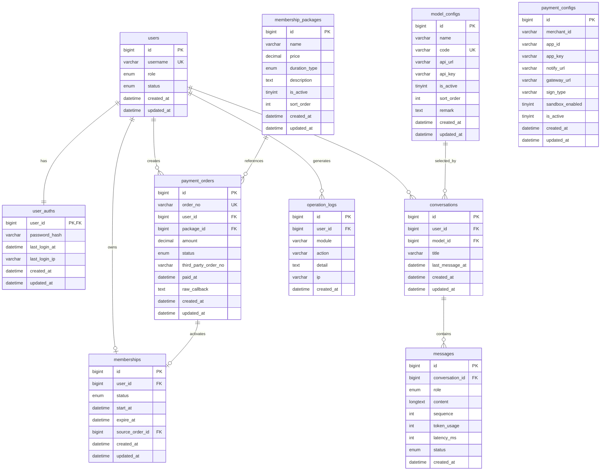

# 大模型对话系统数据库 ER 图与接口文档

## 1. 文档目标

本文档在《大模型对话系统前后端开发方案》的基础上，进一步细化：

- 数据库表结构与表关系
- 核心业务字段设计
- 前后端接口定义
- 主要请求/响应示例
- 权限与状态约束

本文件可直接作为后续数据库建模和前后端联调的基础文档。

## 2. 数据库设计总览

## 2.1 核心实体

系统核心实体如下：

- 用户
- 用户认证
- 会员信息
- 套餐
- 支付配置
- 支付订单
- 模型配置
- 会话
- 消息
- 操作日志

## 2.2 ER 图



## 2.3 关系说明

- `users` 与 `user_auths` 为一对一关系
- `users` 与 `memberships` 为一对多关系
  - 业务上通常只保留一条当前有效记录，也可以保留历史续费记录
- `membership_packages` 与 `payment_orders` 为一对多关系
- `payment_orders` 支付成功后用于激活或延长 `memberships`
- `users` 与 `conversations` 为一对多关系
- `conversations` 与 `messages` 为一对多关系
- `model_configs` 与 `conversations` 为一对多关系

## 3. 数据表详细设计

## 3.1 users

用户基础信息表。

| 字段 | 类型 | 约束 | 说明 |
|---|---|---|---|
| id | bigint | PK | 用户 ID |
| username | varchar(50) | UK, not null | 用户名 |
| role | enum('user','admin') | not null | 用户角色 |
| status | enum('active','disabled') | not null | 用户状态 |
| created_at | datetime | not null | 创建时间 |
| updated_at | datetime | not null | 更新时间 |

索引建议：

- `uk_username(username)`
- `idx_role(role)`

## 3.2 user_auths

用户认证表。

| 字段 | 类型 | 约束 | 说明 |
|---|---|---|---|
| user_id | bigint | PK, FK | 用户 ID |
| password_hash | varchar(255) | not null | 密码哈希 |
| last_login_at | datetime | null | 最近登录时间 |
| last_login_ip | varchar(64) | null | 最近登录 IP |
| created_at | datetime | not null | 创建时间 |
| updated_at | datetime | not null | 更新时间 |

说明：

- 密码必须使用 `bcrypt` 或 `argon2` 保存
- 不保存明文密码

## 3.3 memberships

会员权益表。

| 字段 | 类型 | 约束 | 说明 |
|---|---|---|---|
| id | bigint | PK | 主键 |
| user_id | bigint | FK, not null | 用户 ID |
| status | enum('active','expired') | not null | 会员状态 |
| start_at | datetime | not null | 开始时间 |
| expire_at | datetime | not null | 到期时间 |
| source_order_id | bigint | FK | 来源订单 |
| created_at | datetime | not null | 创建时间 |
| updated_at | datetime | not null | 更新时间 |

索引建议：

- `idx_user_id(user_id)`
- `idx_expire_at(expire_at)`

业务规则：

- `expire_at > now()` 时可以判定为有效会员
- 管理员即使没有有效会员记录，也拥有聊天权限

## 3.4 membership_packages

会员套餐表。

| 字段 | 类型 | 约束 | 说明 |
|---|---|---|---|
| id | bigint | PK | 主键 |
| name | varchar(100) | not null | 套餐名称 |
| price | decimal(10,2) | not null | 套餐金额 |
| duration_type | enum('1_month','3_month') | not null | 有效期类型 |
| description | text | null | 说明文字 |
| is_active | tinyint(1) | not null | 是否启用 |
| sort_order | int | not null default 0 | 排序 |
| created_at | datetime | not null | 创建时间 |
| updated_at | datetime | not null | 更新时间 |

业务规则：

- 前端仅展示 `is_active = 1` 的套餐

## 3.5 payment_configs

支付配置表。

| 字段 | 类型 | 约束 | 说明 |
|---|---|---|---|
| id | bigint | PK | 主键 |
| merchant_id | varchar(128) | null | 商户号 |
| app_id | varchar(128) | null | 应用 ID |
| app_key | varchar(255) | null | 应用密钥 |
| notify_url | varchar(255) | null | 回调地址 |
| gateway_url | varchar(255) | null | 支付网关地址 |
| sign_type | varchar(32) | null | 签名方式 |
| sandbox_enabled | tinyint(1) | not null default 1 | 沙箱开关 |
| is_active | tinyint(1) | not null default 1 | 是否启用 |
| created_at | datetime | not null | 创建时间 |
| updated_at | datetime | not null | 更新时间 |

说明：

- 敏感字段建议做加密存储
- 理论上只保留一条当前生效配置，或通过 `is_active` 控制

## 3.6 payment_orders

支付订单表。

| 字段 | 类型 | 约束 | 说明 |
|---|---|---|---|
| id | bigint | PK | 主键 |
| order_no | varchar(64) | UK, not null | 本地订单号 |
| user_id | bigint | FK, not null | 用户 ID |
| package_id | bigint | FK, not null | 套餐 ID |
| amount | decimal(10,2) | not null | 支付金额 |
| status | enum('pending','paid','failed','closed') | not null | 订单状态 |
| third_party_order_no | varchar(128) | null | 第三方订单号 |
| paid_at | datetime | null | 支付时间 |
| raw_callback | text | null | 原始回调报文 |
| created_at | datetime | not null | 创建时间 |
| updated_at | datetime | not null | 更新时间 |

索引建议：

- `uk_order_no(order_no)`
- `idx_user_id(user_id)`
- `idx_status(status)`

## 3.7 model_configs

模型配置表。

| 字段 | 类型 | 约束 | 说明 |
|---|---|---|---|
| id | bigint | PK | 主键 |
| name | varchar(100) | not null | 模型显示名 |
| code | varchar(100) | UK, not null | 模型编码 |
| api_url | varchar(255) | not null | 调用地址 |
| api_key | varchar(255) | null | 模型密钥 |
| is_active | tinyint(1) | not null | 是否启用 |
| sort_order | int | not null default 0 | 排序 |
| remark | text | null | 备注 |
| created_at | datetime | not null | 创建时间 |
| updated_at | datetime | not null | 更新时间 |

扩展建议：

- 后续可新增 `headers_template`、`default_params`、`timeout_ms`

## 3.8 conversations

聊天会话表。

| 字段 | 类型 | 约束 | 说明 |
|---|---|---|---|
| id | bigint | PK | 主键 |
| user_id | bigint | FK, not null | 用户 ID |
| model_id | bigint | FK, not null | 当前模型 ID |
| title | varchar(255) | null | 会话标题 |
| last_message_at | datetime | null | 最后消息时间 |
| created_at | datetime | not null | 创建时间 |
| updated_at | datetime | not null | 更新时间 |

说明：

- 标题可在首条用户消息后自动生成，如截取前 20 个字符

## 3.9 messages

消息表。

| 字段 | 类型 | 约束 | 说明 |
|---|---|---|---|
| id | bigint | PK | 主键 |
| conversation_id | bigint | FK, not null | 会话 ID |
| role | enum('user','assistant','system') | not null | 消息角色 |
| content | longtext | not null | 消息内容 |
| sequence | int | not null | 顺序号 |
| token_usage | int | null | token 消耗 |
| latency_ms | int | null | 耗时 |
| status | enum('success','failed','streaming') | not null | 状态 |
| created_at | datetime | not null | 创建时间 |

索引建议：

- `idx_conversation_id(conversation_id)`
- `idx_conversation_sequence(conversation_id, sequence)`

## 3.10 operation_logs

后台操作与审计日志表。

| 字段 | 类型 | 约束 | 说明 |
|---|---|---|---|
| id | bigint | PK | 主键 |
| user_id | bigint | FK | 操作人 |
| module | varchar(50) | not null | 模块名 |
| action | varchar(50) | not null | 动作 |
| detail | text | null | 操作详情 |
| ip | varchar(64) | null | IP |
| created_at | datetime | not null | 创建时间 |

## 4. 业务状态与判定规则

## 4.1 用户角色

| role | 含义 |
|---|---|
| user | 普通用户 |
| admin | 管理员 |

## 4.2 会员状态

| status | 含义 |
|---|---|
| active | 有效会员 |
| expired | 已过期 |

## 4.3 订单状态

| status | 含义 |
|---|---|
| pending | 待支付 |
| paid | 已支付 |
| failed | 支付失败 |
| closed | 已关闭 |

## 4.4 消息状态

| status | 含义 |
|---|---|
| streaming | 流式生成中 |
| success | 完成 |
| failed | 失败 |

## 4.5 聊天权限规则

允许聊天的条件：

- `role = admin`
- 或者存在有效会员记录，且 `expire_at > 当前时间`

禁止聊天的条件：

- 非管理员
- 且无有效会员记录

## 5. 接口设计规范

## 5.1 基础规范

- 协议：`HTTPS`
- 风格：`RESTful`
- 编码：`UTF-8`
- 请求体：`application/json`
- 鉴权方式：`Authorization: Bearer <accessToken>`

统一响应结构建议：

```json
{
  "code": 0,
  "message": "ok",
  "data": {}
}
```

统一错误结构建议：

```json
{
  "code": 40001,
  "message": "username already exists",
  "data": null
}
```

## 5.2 错误码建议

| code | 含义 |
|---|---|
| 0 | 成功 |
| 40000 | 请求参数错误 |
| 40001 | 用户名已存在 |
| 40002 | 两次密码不一致 |
| 40003 | 用户名或密码错误 |
| 40004 | 未登录 |
| 40005 | 无权限访问 |
| 40006 | 非会员不可聊天 |
| 40007 | 套餐不存在或不可用 |
| 40008 | 模型不存在或不可用 |
| 40009 | 会话不存在 |
| 50000 | 服务器内部错误 |
| 50001 | 支付下单失败 |
| 50002 | 支付回调验签失败 |
| 50003 | 模型调用失败 |

## 6. 认证模块接口

## 6.1 检查用户名是否可用

`GET /api/auth/check-username`

请求参数：

| 参数 | 类型 | 必填 | 说明 |
|---|---|---|---|
| username | string | 是 | 用户名 |

响应示例：

```json
{
  "code": 0,
  "message": "ok",
  "data": {
    "available": false
  }
}
```

## 6.2 推荐用户名

`GET /api/auth/suggest-username`

请求参数：

| 参数 | 类型 | 必填 | 说明 |
|---|---|---|---|
| username | string | 是 | 原始用户名 |

响应示例：

```json
{
  "code": 0,
  "message": "ok",
  "data": {
    "username": "zhangsan128"
  }
}
```

## 6.3 注册

`POST /api/auth/register`

请求体：

```json
{
  "username": "zhangsan",
  "password": "12345678",
  "confirmPassword": "12345678"
}
```

校验规则：

- 用户名不能为空
- 用户名长度建议 `4~20`
- 用户名必须唯一
- 两次密码必须一致
- 密码长度建议不少于 `8`

成功响应：

```json
{
  "code": 0,
  "message": "ok",
  "data": {
    "userId": 1
  }
}
```

## 6.4 登录

`POST /api/auth/login`

请求体：

```json
{
  "username": "zhangsan",
  "password": "12345678"
}
```

成功响应：

```json
{
  "code": 0,
  "message": "ok",
  "data": {
    "accessToken": "xxxxx",
    "refreshToken": "yyyyy",
    "user": {
      "id": 1,
      "username": "zhangsan",
      "role": "user",
      "membershipStatus": "active",
      "membershipExpireAt": "2026-04-15 12:00:00"
    }
  }
}
```

## 6.5 刷新 Token

`POST /api/auth/refresh`

请求体：

```json
{
  "refreshToken": "yyyyy"
}
```

## 6.6 当前登录用户信息

`GET /api/users/me`

成功响应：

```json
{
  "code": 0,
  "message": "ok",
  "data": {
    "id": 1,
    "username": "zhangsan",
    "role": "user",
    "membershipStatus": "active",
    "membershipExpireAt": "2026-04-15 12:00:00"
  }
}
```

## 7. 会员与套餐接口

## 7.1 获取当前会员信息

`GET /api/memberships/me`

响应示例：

```json
{
  "code": 0,
  "message": "ok",
  "data": {
    "status": "active",
    "startAt": "2026-03-15 12:00:00",
    "expireAt": "2026-04-15 12:00:00",
    "isChatAllowed": true
  }
}
```

## 7.2 获取套餐列表

`GET /api/packages`

响应示例：

```json
{
  "code": 0,
  "message": "ok",
  "data": [
    {
      "id": 1,
      "name": "月度会员",
      "price": 29.9,
      "durationType": "1_month",
      "description": "开通后可与大模型对话 1 个月"
    },
    {
      "id": 2,
      "name": "季度会员",
      "price": 79.9,
      "durationType": "3_month",
      "description": "开通后可与大模型对话 3 个月"
    }
  ]
}
```

## 8. 支付模块接口

## 8.1 创建支付订单

`POST /api/payments/orders`

请求体：

```json
{
  "packageId": 1
}
```

成功响应：

```json
{
  "code": 0,
  "message": "ok",
  "data": {
    "orderId": 1001,
    "orderNo": "P202603150001",
    "amount": 29.9,
    "status": "pending",
    "payParams": {
      "payUrl": "",
      "formHtml": ""
    }
  }
}
```

说明：

- `payParams` 结构要按后续支付平台实际接入结果调整
- 如果支付平台要求表单跳转、二维码、收银台链接，可都放在该字段中

## 8.2 查询订单详情

`GET /api/payments/orders/:id`

响应示例：

```json
{
  "code": 0,
  "message": "ok",
  "data": {
    "id": 1001,
    "orderNo": "P202603150001",
    "status": "paid",
    "amount": 29.9,
    "paidAt": "2026-03-15 12:10:00"
  }
}
```

## 8.3 支付回调

`POST /api/payments/callback`

说明：

- 该接口由支付平台调用
- 入参格式按第三方支付平台文档适配
- 后端执行：
  - 验签
  - 查订单
  - 幂等更新状态
  - 发放会员权益

成功响应示例：

```json
{
  "code": 0,
  "message": "success",
  "data": null
}
```

## 9. 模型与聊天接口

## 9.1 获取可用模型列表

`GET /api/models/available`

响应示例：

```json
{
  "code": 0,
  "message": "ok",
  "data": [
    {
      "id": 1,
      "name": "GPT-4o",
      "code": "gpt-4o"
    },
    {
      "id": 2,
      "name": "DeepSeek Chat",
      "code": "deepseek-chat"
    }
  ]
}
```

## 9.2 获取会话列表

`GET /api/conversations`

查询参数：

| 参数 | 类型 | 必填 | 说明 |
|---|---|---|---|
| page | number | 否 | 页码 |
| pageSize | number | 否 | 每页数量 |

响应示例：

```json
{
  "code": 0,
  "message": "ok",
  "data": {
    "list": [
      {
        "id": 1,
        "title": "帮我写一个登录页",
        "modelId": 1,
        "lastMessageAt": "2026-03-15 13:00:00"
      }
    ],
    "total": 1
  }
}
```

## 9.3 创建会话

`POST /api/conversations`

请求体：

```json
{
  "modelId": 1,
  "title": "新会话"
}
```

成功响应：

```json
{
  "code": 0,
  "message": "ok",
  "data": {
    "id": 1
  }
}
```

## 9.4 获取会话消息列表

`GET /api/conversations/:id/messages`

响应示例：

```json
{
  "code": 0,
  "message": "ok",
  "data": [
    {
      "id": 1,
      "role": "user",
      "content": "你好",
      "status": "success",
      "createdAt": "2026-03-15 13:00:00"
    },
    {
      "id": 2,
      "role": "assistant",
      "content": "你好，请问有什么可以帮你？",
      "status": "success",
      "createdAt": "2026-03-15 13:00:02"
    }
  ]
}
```

## 9.5 发送聊天消息

`POST /api/chat/send`

请求体：

```json
{
  "conversationId": 1,
  "modelId": 1,
  "content": "请帮我写一个用户登录接口",
  "stream": true
}
```

处理规则：

- 校验用户是否有聊天权限
- 校验会话是否属于当前用户
- 校验模型是否启用
- 读取最近 5 轮上下文
- 写入用户消息
- 创建 assistant 占位消息
- 调用模型
- 流式或非流式返回结果

非流式成功响应示例：

```json
{
  "code": 0,
  "message": "ok",
  "data": {
    "messageId": 2002,
    "conversationId": 1,
    "reply": "下面是一个基于 Node.js 的登录接口设计方案..."
  }
}
```

## 9.6 流式消息接口

`GET /api/chat/stream/:messageId`

返回格式：`text/event-stream`

事件示例：

```text
event: chunk
data: {"content":"下面"}

event: chunk
data: {"content":"是一个"}

event: done
data: {"messageId":2002}
```

## 10. 管理端接口

以下接口均要求：

- 已登录
- `role = admin`

## 10.1 用户列表

`GET /api/admin/users`

查询参数：

| 参数 | 类型 | 必填 | 说明 |
|---|---|---|---|
| keyword | string | 否 | 用户名关键词 |
| role | string | 否 | 角色筛选 |
| membershipStatus | string | 否 | 会员状态筛选 |
| page | number | 否 | 页码 |
| pageSize | number | 否 | 每页数量 |

响应示例：

```json
{
  "code": 0,
  "message": "ok",
  "data": {
    "list": [
      {
        "id": 1,
        "username": "admin",
        "role": "admin",
        "membershipStatus": "active",
        "membershipExpireAt": "2026-12-31 23:59:59"
      }
    ],
    "total": 1
  }
}
```

## 10.2 修改用户角色

`PATCH /api/admin/users/:id/role`

请求体：

```json
{
  "role": "admin"
}
```

说明：

- 该接口只允许在 `user` 和 `admin` 之间切换

## 10.3 套餐列表

`GET /api/admin/packages`

## 10.4 新增套餐

`POST /api/admin/packages`

请求体：

```json
{
  "name": "月度会员",
  "price": 29.9,
  "durationType": "1_month",
  "description": "开通后可使用 1 个月",
  "isActive": true,
  "sortOrder": 1
}
```

## 10.5 编辑套餐

`PATCH /api/admin/packages/:id`

请求体：

```json
{
  "price": 39.9,
  "description": "价格调整后说明"
}
```

## 10.6 模型列表

`GET /api/admin/models`

## 10.7 新增模型

`POST /api/admin/models`

请求体：

```json
{
  "name": "GPT-4o",
  "code": "gpt-4o",
  "apiUrl": "https://api.example.com/v1/chat/completions",
  "apiKey": "",
  "isActive": true,
  "sortOrder": 1,
  "remark": "默认模型"
}
```

## 10.8 编辑模型

`PATCH /api/admin/models/:id`

请求体：

```json
{
  "apiUrl": "https://api.example.com/v1/chat/completions",
  "apiKey": "",
  "isActive": true
}
```

## 10.9 获取支付配置

`GET /api/admin/payment-config`

响应示例：

```json
{
  "code": 0,
  "message": "ok",
  "data": {
    "merchantId": "",
    "appId": "",
    "appKey": "",
    "notifyUrl": "",
    "gatewayUrl": "",
    "signType": "md5",
    "sandboxEnabled": true,
    "isActive": true
  }
}
```

## 10.10 更新支付配置

`PUT /api/admin/payment-config`

请求体：

```json
{
  "merchantId": "",
  "appId": "",
  "appKey": "",
  "notifyUrl": "",
  "gatewayUrl": "",
  "signType": "md5",
  "sandboxEnabled": true,
  "isActive": true
}
```

## 10.11 订单列表

`GET /api/admin/orders`

查询参数：

| 参数 | 类型 | 必填 | 说明 |
|---|---|---|---|
| keyword | string | 否 | 用户名/订单号 |
| status | string | 否 | 订单状态 |
| page | number | 否 | 页码 |
| pageSize | number | 否 | 每页数量 |

## 11. 聊天上下文规则细化

每次调用模型时，按如下规则组织上下文：

1. 查询当前会话最近 10 条消息
2. 仅保留最近 5 轮问答
3. 按消息时间正序拼接
4. 若存在 system prompt，则放在最前
5. 当前用户最新问题放在末尾

示意：

```text
system
user
assistant
user
assistant
user
assistant
user
assistant
user
assistant
current_user
```

说明：

- 如果未来需要节约成本，可在 5 轮基础上再增加 token 截断

## 12. 推荐的数据库建模补充约束

建议加上的数据库约束：

- 所有外键字段使用相同类型 `bigint`
- 所有时间字段统一使用 `datetime`
- 所有状态字段尽量使用固定枚举值
- 用户名唯一索引必须建立
- 本地订单号唯一索引必须建立
- 模型编码唯一索引必须建立

## 13. 联调顺序建议

建议按以下顺序联调：

1. 注册 / 登录 / 获取当前用户
2. 用户名校验与随机推荐
3. 套餐查询
4. 管理后台套餐管理
5. 订单创建与支付回调
6. 会员状态同步
7. 模型管理
8. 会话管理
9. 聊天发送与流式输出

## 14. 后续可继续细化的内容

如果继续推进，下一步最有价值的是：

- 输出 `Prisma Schema`
- 输出完整的接口字段 DTO 定义
- 输出管理员后台菜单与页面原型说明
- 输出支付时序图和聊天时序图
